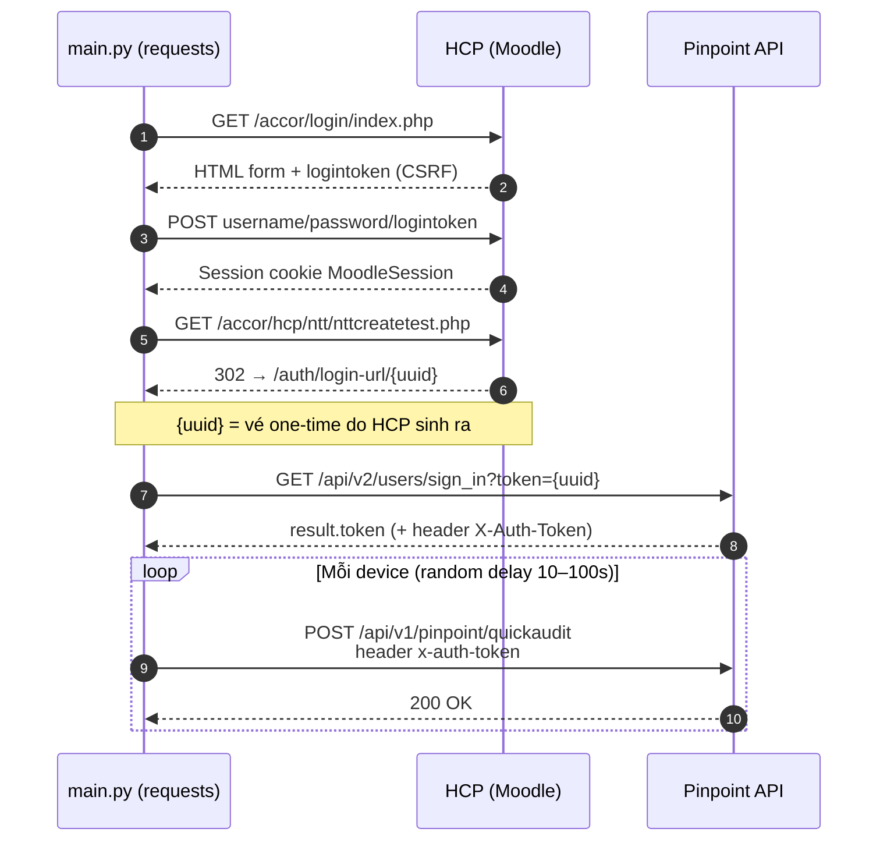

# Pinpoint Batch Quick Audit

Python script tự động đăng nhập vào HCP, truy cập Pinpoint và thực hiện **Quick Audit hàng loạt cho nhiều thiết bị**.

Script hỗ trợ:

* Tự động đăng nhập HCP bằng **HTTP requests thuần** (không cần browser/Playwright).
* Lấy Access Token từ Pinpoint qua cơ chế SSO one-time ticket.
* Thực hiện Quick Audit cho danh sách Device ID.
* Random delay giữa các thiết bị để tránh gửi request liên tục.
* Random delay khi script khởi động.
* Theo dõi số lượng thành công/thất bại.
* Gửi báo cáo kết quả lên Discord.
* Nếu có thiết bị thất bại, Discord hiển thị **Device ID dạng link clickable** để mở trực tiếp thiết bị.

## 1. Yêu cầu

* Python 3.10+
* `requests`
* `python-dotenv`
* Tài khoản HCP hợp lệ
* Discord Webhook

## 2. Cài đặt

Clone hoặc copy project về máy:

```bash
git clone <repository-url>
cd pinpoint-batch-audit
```

Tạo virtual environment:

```bash
python3 -m venv venv
```

Kích hoạt:

### Linux

```bash
source venv/bin/activate
```

### Windows

```powershell
venv\Scripts\activate
```

Cài dependencies:

```bash
pip install -r requirements.txt
```

## 3. Cấu hình `.env`

Tạo file `.env`:

```env
HCP_URL=https://hcp.vigitrust.com
HCP_USERNAME=your_username
HCP_PASSWORD=your_password

PINPOINT_BASE_URL=https://pinpoint.zerorisk.io

DISCORD_WEBHOOK=https://discord.com/api/webhooks/...

DEVICE_IDS=12345,12346,12347,12348

DEVICE_URL_TEMPLATE=https://pinpoint.zerorisk.io/devices/{id}
```

### Các biến

| Biến                  | Mô tả                                        |
| --------------------- | -------------------------------------------- |
| `HCP_URL`             | URL đăng nhập HCP                            |
| `HCP_USERNAME`        | Username HCP                                 |
| `HCP_PASSWORD`        | Password HCP                                 |
| `PINPOINT_BASE_URL`   | URL Pinpoint API                             |
| `DISCORD_WEBHOOK`     | Discord Webhook dùng để gửi báo cáo          |
| `DEVICE_IDS`          | Danh sách Device ID, phân cách bằng dấu phẩy |
| `DEVICE_URL_TEMPLATE` | URL mở trực tiếp Device                      |

Ví dụ:

```env
DEVICE_IDS=10001,10002,10003,10004
```

Script sẽ lần lượt audit:

```text
10001
10002
10003
10004
```

## 4. Chạy thủ công

```bash
python main.py
```

Sau khi chạy, script sẽ random thời gian chờ từ **5 đến 25 phút** trước khi bắt đầu.

Ví dụ:

```text
[*] Script sẽ chạy sau 734 giây...
```

Sau đó script bắt đầu đăng nhập:

```text
[*] Đăng nhập HCP...
[+] Đăng nhập HCP: OK
[*] Lấy vé SSO sang Pinpoint...
[*] Đổi vé lấy Access Token...
[+] Access Token: OK
```

## 5. Quick Audit

Mỗi Device sẽ được random delay từ **10 đến 100 giây** trước khi gửi Quick Audit.

Ví dụ:

```text
[*] Chờ 57 giây trước khi audit thiết bị 12345...
Device 12345 -> Status Code: 200

[*] Chờ 84 giây trước khi audit thiết bị 12346...
Device 12346 -> Status Code: 200
```

## 6. Discord Notification

### Khi tất cả thành công

Discord sẽ gửi embed màu xanh:

```text
✅ Pinpoint Batch Quick Audit

Tổng thiết bị: 10
Thành công: 10
Thất bại: 0
Thời gian: 18 phút 32 giây
```

### Khi có Device thất bại

Discord sẽ gửi embed màu đỏ:

```text
🚨 Pinpoint Batch Quick Audit - FAILED

Tổng thiết bị: 10
Thành công: 8
Thất bại: 2

⚠️ Device bị lỗi

❌ 12345
❌ 12348

Thời gian: 21 phút 14 giây
```

Device ID trong phần **Device bị lỗi** là link clickable.

Click vào Device ID sẽ mở trang tương ứng:

```text
https://pinpoint.zerorisk.io/devices/12345
```

URL thực tế được cấu hình bằng:

```env
DEVICE_URL_TEMPLATE=https://pinpoint.zerorisk.io/devices/{id}
```

## 7. Chạy tự động khi server khởi động

Nếu chạy trên Ubuntu/Debian, có thể sử dụng `systemd`.

Tạo service:

```bash
sudo nano /etc/systemd/system/pinpoint-audit.service
```

Nội dung:

```ini
[Unit]
Description=Pinpoint Batch Quick Audit
After=network-online.target
Wants=network-online.target

[Service]
Type=simple
User=root
WorkingDirectory=/opt/pinpoint-audit
ExecStart=/opt/pinpoint-audit/venv/bin/python /opt/pinpoint-audit/main.py
Restart=always
RestartSec=10

EnvironmentFile=/opt/pinpoint-audit/.env

StandardOutput=journal
StandardError=journal

[Install]
WantedBy=multi-user.target
```

Reload systemd:

```bash
sudo systemctl daemon-reload
```

Enable tự động khởi động:

```bash
sudo systemctl enable pinpoint-audit
```

Start:

```bash
sudo systemctl start pinpoint-audit
```

Kiểm tra:

```bash
sudo systemctl status pinpoint-audit
```

Xem log realtime:

```bash
journalctl -u pinpoint-audit -f
```

## 8. Restart service

Nếu thay đổi code:

```bash
sudo systemctl restart pinpoint-audit
```

Kiểm tra:

```bash
sudo systemctl status pinpoint-audit
```

## 9. Dừng service

```bash
sudo systemctl stop pinpoint-audit
```

Tắt tự động khởi động:

```bash
sudo systemctl disable pinpoint-audit
```

## 10. Cấu trúc project

```text
pinpoint-batch-audit/
├── main.py
├── .env
├── .gitignore
├── requirements.txt
├── AGENTS.md
└── README.md
```

Không commit `.env` lên Git:

```gitignore
.env
venv/
__pycache__/
*.pyc
```

## 11. Dependencies

`requirements.txt`:

```text
requests
python-dotenv
```

Cài đặt:

```bash
pip install -r requirements.txt
```

## 12. Luồng hoạt động & cơ chế xác thực

### 12.1. Cơ chế xác thực (SSO thuần HTTP, không cần browser)

Access Token **do server Pinpoint cấp**, không phải do JS sinh ra ở client.
Toàn bộ chuỗi chỉ gồm 4 request HTTP:

```text
1. GET {HCP_URL}/accor/login/index.php
      └── parse logintoken (CSRF token) từ HTML form

2. POST {HCP_URL}/accor/login/index.php
      data: username, password, logintoken, anchor
      └── nhận session HCP (cookie MoodleSession)

3. GET {HCP_URL}/accor/hcp/ntt/nttcreatetest.php   (allow_redirects=False)
      └── trả 302 Location:
          https://pinpoint.zerorisk.io/auth/login-url/{uuid}
          → {uuid} là vé one-time do HCP sinh ra (mỗi lần đăng nhập 1 giá trị)

4. GET https://pinpoint.zerorisk.io/api/v2/users/sign_in?token={uuid}
      headers: x-requested-with: XMLHttpRequest
               referer: {base}/auth/login-url/{uuid}
      └── server đổi vé lấy session, trả về:
          body : {"result": {"token": "...", "userId": ..., "entityId": ...}}
          header: X-Auth-Token: ...
```

Token lấy từ `result.token` trong body (fallback: header `X-Auth-Token`).
Sau đó mọi API call chỉ cần header `x-auth-token` — **không cần cookie** của domain zerorisk.io.

Sơ đồ sequence (GitHub tự render Mermaid):



### 12.2. Luồng tổng thể

```text
Server start
     │
     ▼
Random delay 5–25 phút
     │
     ▼
Đăng nhập HCP (POST form + logintoken CSRF)
     │
     ▼
GET nttcreatetest.php → vé one-time UUID (302)
     │
     ▼
GET /api/v2/users/sign_in?token={uuid} → Access Token
     │
     ▼
Đọc DEVICE_IDS
     │
     ▼
┌──────────────────────┐
│ Device 1             │
│ Random delay 10–100s │
│ Quick Audit          │
└──────────────────────┘
     │
     ▼
┌──────────────────────┐
│ Device 2             │
│ Random delay 10–100s │
│ Quick Audit          │
└──────────────────────┘
     │
     ▼
        ...
     │
     ▼
Tổng hợp kết quả
     │
     ▼
Gửi Discord
     │
     ├── Tất cả OK → 🟢
     │
     └── Có lỗi → 🔴
                  │
                  └── Device lỗi dạng clickable link
```

## 13. Lưu ý bảo mật

Không đưa các thông tin sau lên GitHub hoặc chia sẻ công khai:

* `HCP_USERNAME`
* `HCP_PASSWORD`
* `DISCORD_WEBHOOK`
* Access Token
* Cookie/session

File `.env` nên được thêm vào `.gitignore`.

Nếu Discord Webhook bị lộ, hãy **xóa/revoke webhook cũ và tạo webhook mới**.

## 14. Troubleshooting

### Không lấy được Access Token

Kiểm tra:

```text
HCP_USERNAME
HCP_PASSWORD
HCP_URL
```

Sau đó kiểm tra thủ công bằng trình duyệt:

1. Đăng nhập HCP, xem trang vẫn còn link **"Click here to access the terminal inventory"**
   (link này trỏ tới `ntt/nttcreatetest.php` — nếu HCP đổi đường dẫn, phải cập nhật URL trong `login()`).
2. Form đăng nhập Moodle: nếu HCP thêm/sửa field (vd `logintoken`), phải cập nhật
   phần POST trong `login()`.
3. Nếu `sign_in` trả lỗi (không phải 200): vé one-time có thể đã hết hạn hoặc bị dùng 2 lần —
   mỗi vé chỉ dùng được đúng 1 lần, chạy lại script để lấy vé mới.

Lỗi thường gặp:

```text
[-] Đăng nhập HCP thất bại: ...        → sai username/password hoặc HCP đổi form login
[-] Không lấy được vé SSO              → HCP đổi path nttcreatetest.php hoặc session không hợp lệ
[-] sign_in thất bại: 4xx              → vé one-time hết hạn/không hợp lệ
```

### Discord không nhận thông báo

Kiểm tra:

```env
DISCORD_WEBHOOK=https://discord.com/api/webhooks/...
```

Có thể test webhook bằng:

```bash
curl -X POST \
  -H "Content-Type: application/json" \
  -d '{"content":"Pinpoint Audit test"}' \
  "$DISCORD_WEBHOOK"
```

### Service không chạy

Xem log:

```bash
journalctl -u pinpoint-audit -n 100 --no-pager
```

Hoặc:

```bash
systemctl status pinpoint-audit
```

## 15. License

Internal use.
